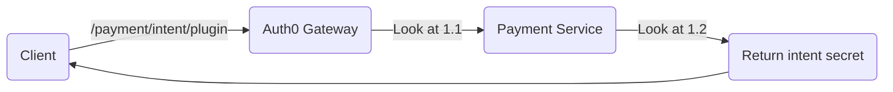

# Introduction

A series of personal projects/products using the brand name JTM-Network. The aim of these projects is to solve business problems, using microservice architecture, to split the problems into sub-problems and to be integrated into the Kubernetes Cluster without affecting current processes & offers scalability. Most services used in the Network are public as to show how we solve these problems.

## Table contents
- [Technologies](#technologies)
- [FAQ](#faq)
- [Flow logic](#flow-logic)

## Technologies

### Languages:
- [Java](https://www.java.com/en)
- [Kotlin](https://kotlinlang.org)
- [JavaScript](https://www.javascript.com)

### Frameworks:
- [Spring Boot](https://spring.io/projects/spring-boot)
- [Spring Webflux](https://docs.spring.io/spring-framework/docs/current/reference/html/web-reactive.html)
- [VueJS](https://vuejs.org/)
- [NuxtJS](https://nuxtjs.org/)

### Dev Ops:
- [Docker](https://www.docker.com/)
- [Kubernetes](https://kubernetes.io/)
- [Github Actions](https://github.com/features/actions)
- [Google Cloud Platform](https://cloud.google.com/)

### Databases:
- [MongoDB](https://www.mongodb.com/)
- [Cassandra](https://cassandra.apache.org/_/index.html)
- [Redis](https://redis.io/)
- [SQL](https://en.wikipedia.org/wiki/SQL)

## FAQ

## Flow logic

### Premium Plugin Payment Flow:

Request Endpoint: /payment/intent/plugin\
Request Header: Authorization: Bearer $token\
Request Body: { total: Double, currency: String, plugins: List<UUID> }

1.1.
- Uses Bearer token to get client info from Auth0 Management Server.
- Add header CLIENT_ID with client identifier and forward to payment service.

1.2.
- Use the client id and request body to create a payment intent.
- Return the intent secret to the client to be used to complete the payment.

